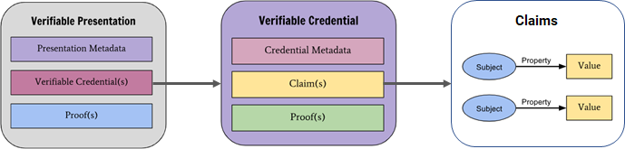
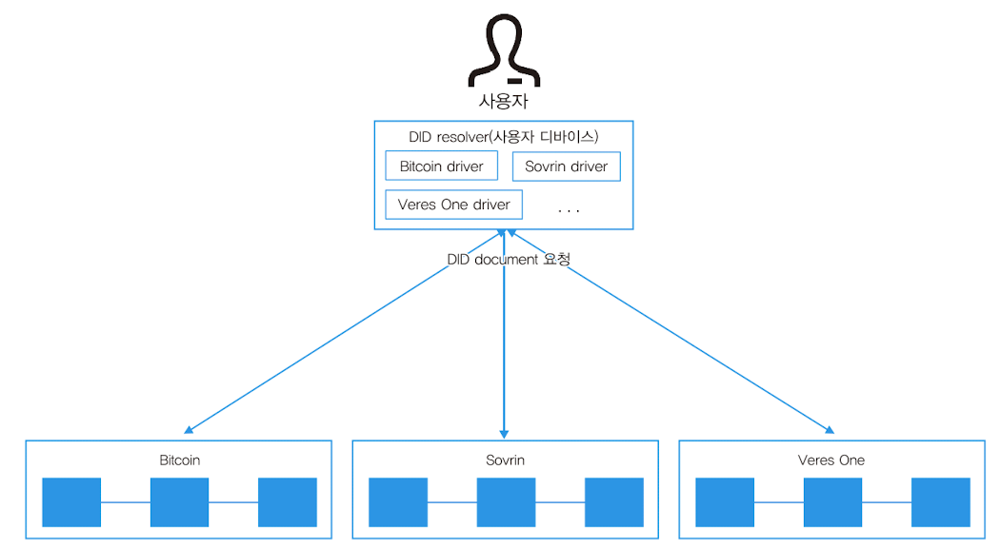
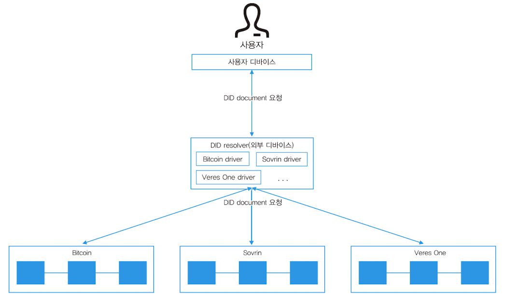

# Hyperledger Indy & Aries

## DID 개요

### SSI(Self-Sovereign Identity, 자기주권 신원증명)

1. 신원 증명의 권한은 자신한테 있다

2. Verifiable Credential(VC, 보관용ID), Verifiable Presentation(VP, 제출용ID)가 따로 존재

3. ZKP(Zero-Knowledge Proof)을 사용하면 속성을 알려주지 않고 검증 가능
   - ZKP는 영지식 증명이라고 한다
   - 영지식 증명이란 상대방에게 어떤 정보가 진실이라는 것을 증명할 때, 그 정보가 진실인지 혹은 거짓인지 알려주는 결과를 제외하고 그 어떤 정보도 노출되지 않도록 하는 절차
   - 쉽게 말해서 주민등록증을 인증할 때 민감 정보를 보여주지 않고 내가 미성년자가 아니다라는 것을 증명할 수 있다.

### SSI 구성요소

- DID
- DID document
- VC(Verifiable Credential, 보관용ID) - 주민등록등본, 학력과 같은 사적 발급 정보
  - Credential Metadata: 
  - Claim(s) : 사용자의 데이터가 들어가는 부분, Key-Value 형태로 저장
  - Proof(s) : Claim에 대하여 이슈어(Issuer)가 자신의 개인키로 서명한 검증데이터가 들어감

- VP(Verifiable Presentation, 제출용ID)

1. 권한이 있는 발행자(Issuer)가 사용자(User)에게 증명서를 발급해 주고 블록체인에서 자신(Issuer)의 Key를 가져와서 사인한다.

2. 받은 증명서에서 특정 데이터만 추려서 블록체인에 있는 자신(User)의 Key를 가져와서 서명을 한다.

3. 최종적으로 인증기관(Verifier)이 블록체인에서 발행자(Issuer)와 사용자(User)의 Key를 가져와서 사용자가 제출한 VP가 유효한 인증서인지를 판별한다.

### DID 구성요소

즉 , **Claim**들이 모여서 **Credential**(신원)이 이루어지고 이를 **Proof**(검증)함으로써 **Verifiable Credential**이 만들어지고, Verifiable Credential을 참조하여 **Presentation**을 만들고 그것을 Proof(검증)함으로써 **Verifiable Presentation**을 형성하게 된다. 

주민등록증을 예로 들어보자. 주민등록증에는 아래와 같은 개인에 대한 정보들을 포함하고 있다.

- 이름
- 사진
- 주민등록번호 (생년월일, 성별, 출생등록지)
- 주소
- 기타 (등록일, 등록지, 변동사항)

위의 각 정보가 **Claim**이라고 하면, 주민등록증 상의 내용들은 **Credential**이 된다. Issuer가 Credential을 만든다고 하였으므로 여기서 **Issuer는 국가기관**이 된다.

Verifiable Credential은 이것에서 한단계 더 나아가 이것이 정말로 올바른 정보인지를 보여주기 위해 Issuer가 서명함으로써 Proof하는 것이다. 최종적으로 **Presentation**은 위 정보를 바탕으로 만들 수 있는 **신원 정보**이다. 주민등록번호를 바탕으로 우리는 주민등록번호를 보여줄 필요 없이 스스로가 성인임을 증명할 수 있다.

참조:**https://fortheneedy.medium.com/verifiable-presentation%EC%9D%98-data%EC%B0%B8%EC%A1%B0-%EB%B0%8F-%EA%B2%80%EC%A6%9D-77c9ce3062f7**

### DID 및 DID Document

**DID(Decentralized Identifier): 이용자가 직접 생성하고 제어할 수 있는 분산형 식별자**

- DID를 사용하는 객체에 대한 식별자로 사용
- 인증 수단인 DID document를 참조할 수 있는 URI로 DID를 사용

### DID 관리방식

1. 회사가 직원 DID에 대해 DID Auth(인증) 권한을 가질 수 있음(인증 주체가 회사가 되는 경우)
2. 직원과 당사자 모두가 인증 권한을 가질 수 있음 -> 직원이 비밀키를 잃어버린 경우

3. DID를 비활성화 시킬 시에는 공개키를 0000 으로 변경해 줌으로써 0에대한 비밀키를 누가 가지고 있는지 알수 없게

   처리함으로써 비활성화 시킴

### DID resolve 관리방식

#### 1. **사용자 디바이스에 설치된 DID resolver(사용자 PC, 모바일 단말)**

​	**장점**: 사용자가 직접 DID document를 저장하고 불러오기 때문에 CA와 같은 제 3의 기관 없이 신뢰성 있는 

​			결과를 수신할 수 있다.

​	**단점**: 다양한 종류의 DID document 저장소를 사용할수록 사용자 디바이스에 이를 지원하는 DID resolver driver을  설치해야함

​        -> 모든 사람이나 기관이 하나의 통일된 저장소에 DID document를 저장하지 않기 때문에 원활한 DID Auth를 수행하려면

​           많은 사람들이 사용하는 대표적인 저장소에 대한 DID resolver driver가 필수적으로 설치돼 있어야 함

#### 2. 서버와 같은 외부 디바이스에 설치된 DID resolver

​	**장점**: 사용자의 디바이스에 부담이 덜 가고 고사양의 외부 DID resolver를 통해 좀 더 원활한 서비스를 사용할 수 있다는점, REST API를 이용해 

​			DID document를 요청하는 메시지만 보낼 수 있으면 됌. 요청을 받은 외부 DID resolver가 실제 블록체인에게 DID document를 요청하고 

​			수신 받은 후 사용자에게 전달

​	**단점**: DID resolver를 통해 다수의 사용자에게 DID document를 제공할 경우, 해커들의 표적이 되는 잠재적인 위협이 발생할 수도 있다.

## **Hyperledger Indy, Aries**

### Hyperledger Indy

- **indy-node** : DID document와 같이 신원 인증에 필요한 데이터를 신뢰성 있게 저장하기 위해서 블록체인을 사용하는 프로젝트
- 신원 인증을 위한 Schema, Credential, definition 등의 트랜잭션을 개발하여, indy-plenum에 플러그인하여 사용하는 프로젝트

​		1. **Domain ledger**: DID와 같이 사용자의 신원 인증과 관련된 데이터 저장

​		2. **Config ledger**: Public-Permissioned 구조의 블록체인인 indy-node에 대한 사용자 권한 정보를 저장

​		3. **Pool ledger**: 블록체인 노드의 IP/PORT 등과 같은 정보를 저장

​		4. **Audit ledger**: 위 3가지 원장의 트랜잭션을 순서대로 저장하고 있다가 동기화 복구 등이 필요한 경우 사용

- **indy-sdk** : 블록체인과 클라이언트 간의 통신을 위한 API 개발을 연구하는 프로젝트

### Hyperledger Aries

​	- DID, VC, VP 등 사용자가 직접 사용하는 상위 데이터 프로토콜을 개발하기 위한 프로젝트
