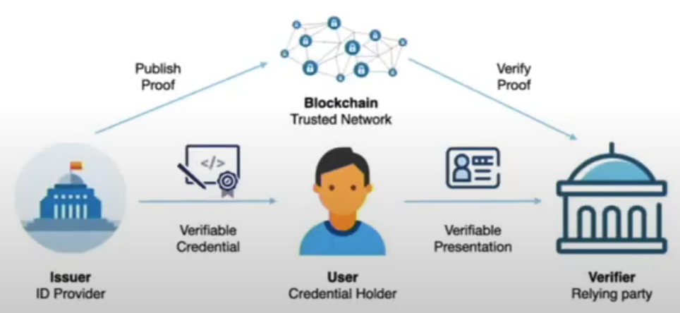

# Hyperledger Indy & Aries

## DID 개요

### SSI(Self-Sovereign Identity, 자기주권 신원증명)

1. 신원 증명의 권한은 자신한테 있다

2. Verifiable Credential(VC, 보관용ID), Verifiable Presentation(VP, 제출용ID)가 따로 존재

3. ZKP(Zero-Knowledge Proof)을 사용하면 속성을 알려주지 않고 검증 가능

- - ZKP는 영지식 증명이라고 한다
  - 영지식 증명이란 상대방에게 어떤 정보가 진실이라는 것을 증명할 때, 그 정보가 진실인지 혹은 거짓인지 알려주는 결과를 제외하고 그 어떤 정보도 노출되지 않도록 하는 절차
  - 쉽게 말해서 주민등록증을 인증할 때 민감 정보를 보여주지 않고 내가 미성년자가 아니다라는 것을 증명할 수 있다.

### SSI 구성요소

- DID
- DID document
- VC(Verifiable Credential, 보관용ID) - 주민등록등본, 학력과 같은 사적 발급 정보
- VP(Verifiable Presentation, 제출용ID)

1. 권한이 있는 발행자(Issuer)가 사용자(User)에게 증명서를 발급해 주고 블록체인에서 자신(Issuer)의 Key를 가져와서 사인한다.

2. 받은 증명서에서 특정 데이터만 추려서 블록체인에 있는 자신(User)의 Key를 가져와서 서명을 한다.

3. 최종적으로 인증기관(Verifier)이 블록체인에서 발행자(Issuer)와 사용자(User)의 Key를 가져와서 사용자가 제출한 VP가 유효한 인증서인지를 판별한다.

